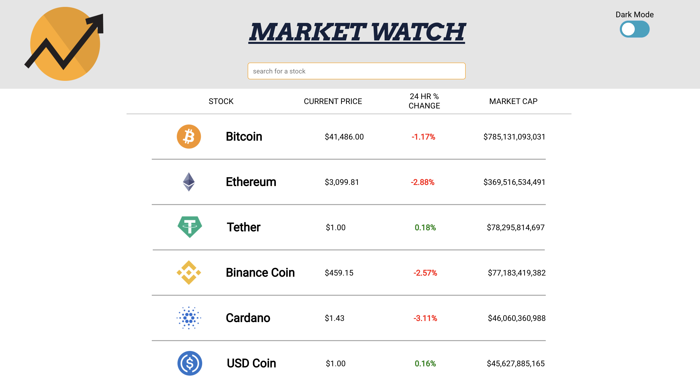

<div id="top"></div>
<!--
*** Thanks for checking out the Best-README-Template. If you have a suggestion
*** that would make this better, please fork the repo and create a pull request
*** or simply open an issue with the tag "enhancement".
*** Don't forget to give the project a star!
*** Thanks again! Now go create something AMAZING! :D
-->


<!-- PROJECT SHIELDS -->
<!--
*** I'm using markdown "reference style" links for readability.
*** Reference links are enclosed in brackets [ ] instead of parentheses ( ).
*** See the bottom of this document for the declaration of the reference variables
*** for contributors-url, forks-url, etc. This is an optional, concise syntax you may use.
*** https://www.markdownguide.org/basic-syntax/#reference-style-links
-->
[![Contributors][contributors-shield]][contributors-url]
[![Issues][issues-shield]][issues-url]


<!-- PROJECT LOGO -->
<br />
<div align="center">
  <a href="https://github.com/aburg15/market-watch">
    
  </a>

<h3 align="center">Market Watch</h3>

  <p align="center">
    A UI for viewing cyrptocurrency stock prices, market cap and daily % change.
    <br />
    <a href="https://aburg15.github.io/market-watch/"><strong>View demo</strong></a>
    <br />
  </p>
</div>


<!-- TABLE OF CONTENTS -->
<details>
  <summary>Table of Contents</summary>
  <ol>
    <li>
      <a href="#about-the-project">About The Project</a>
      <ul>
        <li><a href="#built-with">Built With</a></li>
      </ul>
    </li>
    <li>
      <a href="#getting-started">Getting Started</a>
      <ul>
        <li><a href="#prerequisites">Prerequisites</a></li>
        <li><a href="#installation">Installation</a></li>
      </ul>
    </li>
    <li><a href="#usage">Usage</a></li>
    <li><a href="#roadmap">Roadmap</a></li>
    <li><a href="#contributing">Contributing</a></li>
    <li><a href="#license">License</a></li>
    <li><a href="#contact">Contact</a></li>
    <li><a href="#acknowledgments">Acknowledgments</a></li>
  </ol>
</details>


<!-- ABOUT THE PROJECT -->
## About The Project


Market Watch was created to provide users with a quick, intuitive and informative dashboard which displays up to date cryptocurrency stock information.  Users have the ability to click on each cryptocurrency listed in order to learn more information behind the currency that was selected.

This project uses React, Cypress, JavaScript, React Router and data pulled from a RESTful API to display a dashboard of stocks. Select a stock to learn more about it. 

This project was crafted as part of the curriculum for [Turing School of Software and Design](https://turing.edu/). You can view the project spec [here](https://frontend.turing.edu/projects/module-3/showcase.html).

<p align="right">(<a href="#top">back to top</a>)</p>


### Built With

  - 
  - 
  - 
  - 
  - 
  - 
  - 
  - 
  - 
  - 


<p align="right">(<a href="#top">back to top</a>)</p>


<!-- GETTING STARTED -->
## Getting Started

This project is deployed [here](https://aburg15.github.io/market-watch/) on GitHub Pages, but if you'd like to interact with it on your local machine, follow the instructions below.

### Installation

1. Clone the repo
   ```sh
   git clone https://github.com/aburg15/market-watch.git
   ```
2. Install NPM packages
   ```sh
   npm install
   ```
3. Deploy the project on your machine
   ```sh
   npm start
   ```

<p align="right">(<a href="#top">back to top</a>)</p>


<!-- USAGE EXAMPLES -->
## Usage

Scroll through the main page to view all stocks in the database. To find a specific stock, use the search bar in the header. Click on a stock to view its details. 

<details>
<summary>Main Page</summary>
<br>

</details>

<details>
<summary>Specific Stock Page</summary>
<br>


</details>

<p align="right">(<a href="#top">back to top</a>)</p>


## Future Updates 
I was able to accomplish a lot with this project. However, there a few things I would like to improve on in future iterations:
* Fine-tune the responsive design
* More robust selected stock page content
* Improved accessibility experience
* Utilizing Sass to DRY up styling
<!-- CONTACT -->
## Contributors

**Adam Burgess**: [GitHub](https://github.com/aburg15) | [LinkedIn](https://www.linkedin.com/in/burgess-adam/) | [aburg1515@gmail.com](mailto:aburg1515@gmail.com)


<p align="right">(<a href="#top">back to top</a>)</p>


<!-- MARKDOWN LINKS & IMAGES -->
<!-- https://www.markdownguide.org/basic-syntax/#reference-style-links -->
[contributors-shield]: https://img.shields.io/github/contributors/aburg15/market-watch.svg?style=for-the-badge
[contributors-url]: https://github.com/aburg15/market-watch/graphs/contributors
[forks-shield]: https://img.shields.io/github/forks/aburg15/market-watch.svg?style=for-the-badge
[forks-url]: https://github.com/aburg15/market-watch/network/members
[stars-shield]: https://img.shields.io/github/stars/aburg15/market-watch.svg?style=for-the-badge
[stars-url]: https://github.com/aburg15/market-watch/stargazers
[issues-shield]: https://img.shields.io/github/issues/aburg15/market-watch.svg?style=for-the-badge
[issues-url]: https://github.com/aburg15/market-watch/issues
[license-shield]: https://img.shields.io/github/license/aburg15/market-watch.svg?style=for-the-badge
[license-url]: https://github.com/aburg15/market-watch/blob/master/LICENSE.txt
[linkedin-shield]: https://img.shields.io/badge/-LinkedIn-black.svg?style=for-the-badge&logo=linkedin&colorB=555
